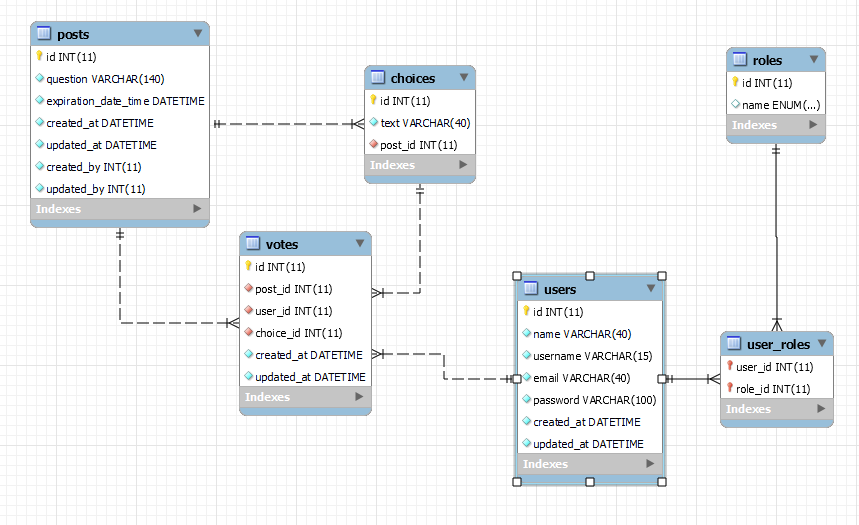
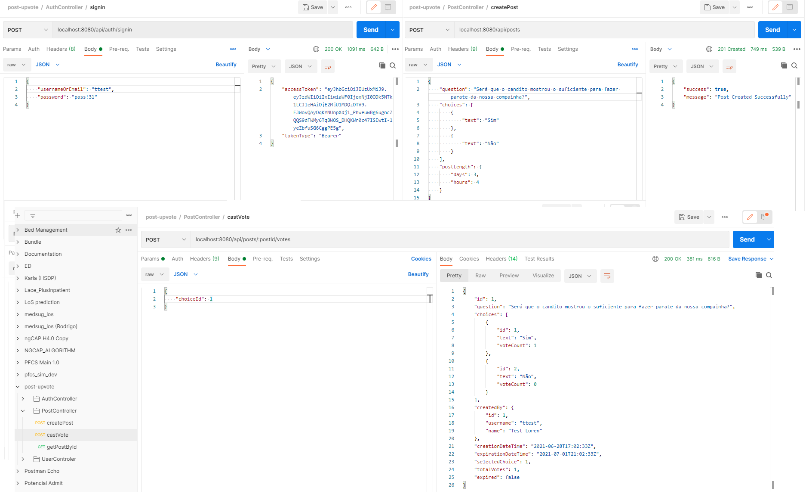

<h1 align="center">
    Up-Vote
</h1>
<h4 align="center"> 
:construction: Spring-boot mysql and docker.. :construction:
</h4>

  

  
	
  

  

  

  <a href="#-project">Project</a>&nbsp;&nbsp;&nbsp;|&nbsp;&nbsp;&nbsp;
  <a href="#-technologies">Technologies</a>&nbsp;&nbsp;&nbsp;|&nbsp;&nbsp;&nbsp;
  <a href="#-arquitecture">Architecture</a>&nbsp;&nbsp;&nbsp;|&nbsp;&nbsp;&nbsp;
  <a href="#-isntalation">Intalation</a>&nbsp;&nbsp;&nbsp;|&nbsp;&nbsp;&nbsp;

## 💻 Project

The project was developed in order to solidify the knowledge of java using the spring boot framework with a connection presistened in mysql. Using docker to create containers for the program to work in any environment.
I can say that the project includes an example of how to develop a safe and functional API.

## Technologies

This project was developed with the following technologies:
- [Java 11](https://docs.oracle.com/en/java/)
- [Sprring](https://spring.io/)
- [MySql](https://www.mysql.com/)
- [Docker](https://www.docker.com/)

## Architecture
The spring boot architecture flow

### Database
The Database Model

 The database structer file is `engailtonoliveira/spring-boot-mysql-docker/up_vote_db_bk.sql`

## Instalation
To execute the repository first downloat for your machine or do the  `Git Clone`

### Backend 
- open the folder `spring-boot-com-mysql/` on your IntelliJ
- go to the right panel and open `Maven Project`in Livecycle select `clean` and `install` than click in `Run Maven build`
- last open your terminal and type `docker-compose up --build --force-recreate` 
- run database script `up_vote_db_bk.sql` for create structer database (obs: it is a temporary solution later i will use the generated database)

#### Usage
One the docker is running, open the Postman collection `engailtonoliveira/spring-boot-mysql-docker\post-upvote.postman_collection.json` and you will be able to send/recive API request. 
Several example requests are provided in the collection. Below is a screenshot of a Postman example.

I will be exemplify how to test
- For registe the user send `post-upvoute.AuthController.sigup`
- For sigin on aplication send `post-upvoute.AuthController.signin` (obs: it will be send the Authorization use than for send data to the restring URL)
- For Post the question you need to send the `post-upvoute.PostController.createPost` (Obs: remeber change the Authorization token for the user was signin)
- To Vote one of the choice u need to send `post-upvoute.PostController.castVote`

Obs: have other enpoinds configured, feel free to test

### Frontend
Unbelievably it will be as future work

---

Made with ♥ by Ailton Oliveira :wave: [Get in touch!](https://www.linkedin.com/in/ailton-oliveira-127366126/)
